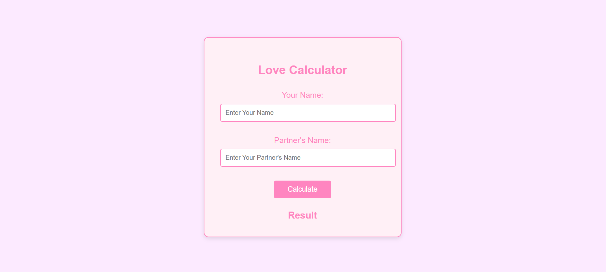

# Love Calculator

Let's see how much your partner loves you!  
A fun Love Calculator web app that calculates the love percentage between you and your partner based on their names. This interactive and playful app generates a love percentage score along with a message that reflects the compatibility of your relationship. Perfect for sharing with friends or for a bit of fun with a partner!

## Features

- Enter your name and your partner's name.
- Calculate the love percentage with just a click.
- A personalized message based on the result, ranging from "Not a Great Match" to "Soulmates!"
- Smooth, responsive design with a soft color scheme.

## Screenshot

*This is a basic interface of the Love Calculator.*

## How It Works

1. **Input Fields**: Enter your name and your partner's name in the provided fields.
2. **Calculate Button**: Click the "Calculate" button to generate a love percentage score.
3. **Result**: The love percentage along with a matching message (e.g., "Great Match!" or "Not a Great Match. Keep Looking!") will be displayed on the screen.

## Why Use It?

- **Fun**: It’s a fun and lighthearted app to try out with friends or a partner.
- **Interactive**: Enjoy the surprise element of a randomly generated love percentage.
- **Simple and Easy**: Just input names and click calculate. No complicated steps.

## Future Enhancements

Here are a few upcoming features we plan to add:

- **User Account**: Save love percentages for future reference.
- **Love Quotes**: Display a random love quote based on the result.
- **Themed Versions**: Different themes for holidays, e.g., Valentine's Day theme.
- **Mobile App**: A mobile app version of the calculator.

## Contribution

If you'd like to contribute to this project, follow these steps:

1. Fork the repository.
2. Clone your fork locally.
3. Create a new branch (`git checkout -b feature-name`).
4. Commit your changes (`git commit -am 'Add feature'`).
5. Push to the branch (`git push origin feature-name`).
6. Create a pull request to the main branch.

## Disclaimer

This Love Calculator is just for fun and doesn't use any real algorithm to determine compatibility. It’s all random and lighthearted. Please enjoy the results with a sense of humor!

---
If you encounter any bugs or issues while using the app, please open an issue on this repository. Feel free to report any suggestions or improvements as well!

